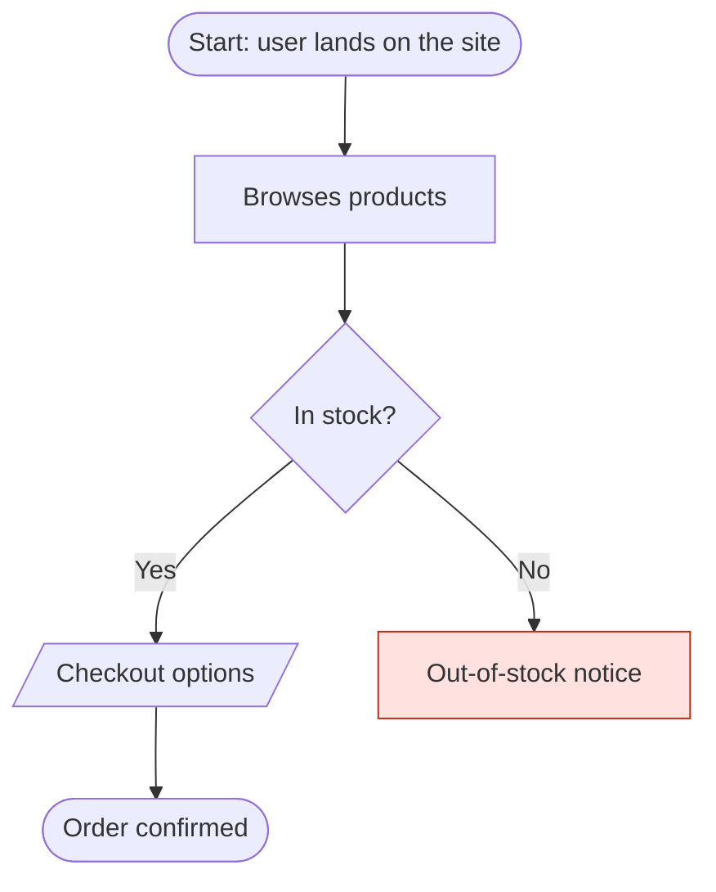

# Markdown to Flow

Turn Markdown user flows with Mermaid diagrams into editable flow diagrams and documentation cards, right inside Figma & FigJam.

  


<!-- TODO: add a screenshot or GIF of the plugin in action at docs/hero.png -->

---

## ✨ What it does

- **Native diagrams in both editors** — generates real, editable nodes and connectors in Figma Design (components + instances) and FigJam (native shapes).
- **Semantic shapes and colors** — start/end, process, decision, options/input and junction shapes, with class-based coloring straight from your Mermaid `classDef`s.
- **Documentation cards** — turns the written content (steps, decisions, assumptions, edge cases) into cards next to the diagram.
- **Four layout styles** — Classic flowchart, self-contained Cards, Swimlanes by re-entry point, or a Table of cases; dense flows get simplified automatically.
- **Flexible input** — `.md`, `.markdown` or `.txt`, multiple flows per file, vertical or horizontal direction, optional separation of edge cases/errors.
- **Bilingual UI** — English / Español, with your file's content always kept as-is.

## 🚀 How to use

1. *(Optional)* Download the example markdown from inside the plugin to see the expected format.
2. Upload a `.md` / `.markdown` / `.txt` file, or paste your user flow content.
3. In **Customize Flow**, choose what to generate, the layout style, direction and language.
4. Press **Generate**.
5. Your flow diagram and documentation appear on the canvas as native, editable elements.

> **Tip:** an exact file structure isn't required — the plugin detects sections and the Mermaid diagram wherever it finds them, and does its best with what's there.

## 📝 Input format

Any Markdown/text with a Mermaid flowchart works. Shapes map to node types, and classes drive the coloring:



A complete example file is downloadable from the plugin's **Upload** tab.

## 🔧 Install (development)

```bash
git clone https://github.com/bochenn/markdown-to-flow.git
cd markdown-to-flow
npm install
npm run build
```

Then in Figma or FigJam (desktop app): **Plugins → Development → Import plugin from manifest…** and pick `manifest.json`.

---

## 🤝 Open source

This plugin is open source under the MIT license (see `LICENSE`). You're free to use,
modify and improve it, including for commercial purposes — the only requirement is
keeping the copyright notice. If you do build on it, a heads-up and a credit to the
original plugin are appreciated (a courtesy, not a legal obligation). Feature requests
and ideas are welcome.

Created and maintained by Leandro Henflen — [crafter.studio](https://crafter.studio/) ·
[x.com/bochenn](https://x.com/bochenn) · [linkedin.com/in/bochenn](https://linkedin.com/in/bochenn).
If it saves you time, a donation helps keep the development going:
[buymeacoffee.com/bochenn](https://buymeacoffee.com/bochenn).

## 📜 License

[MIT](LICENSE) © 2026 Leandro Henflen.

The MIT license covers the original source code of this project. It does not cover the
bundled third-party icon assets — see Credits below.

## 🙏 Credits

- **Icons** — the UI icons in `Resources/figma-UI3/` are taken from [UI3 — Figma's UI Kit](https://www.figma.com/community/file/1486123838948777078/) on the Figma Community. The kit does not state an explicit license, so these icons are included in good faith under [Figma's Community terms](https://www.figma.com/community) and remain the property of their original author(s). They are not covered by this project's MIT license; if you redistribute or reuse them, verify their terms yourself.
- **Fonts** — Inter and Roboto Mono are referenced by name and loaded from the user's Figma environment at runtime. No font files are bundled or redistributed by this plugin.
- **Build tooling (dev dependencies)** — [esbuild](https://github.com/evanw/esbuild), [TypeScript](https://github.com/microsoft/TypeScript), [@figma/plugin-typings](https://github.com/figma/plugin-typings) and [@types/node](https://github.com/DefinitelyTyped/DefinitelyTyped), all under the MIT license.

## 📦 Status

In active development.
