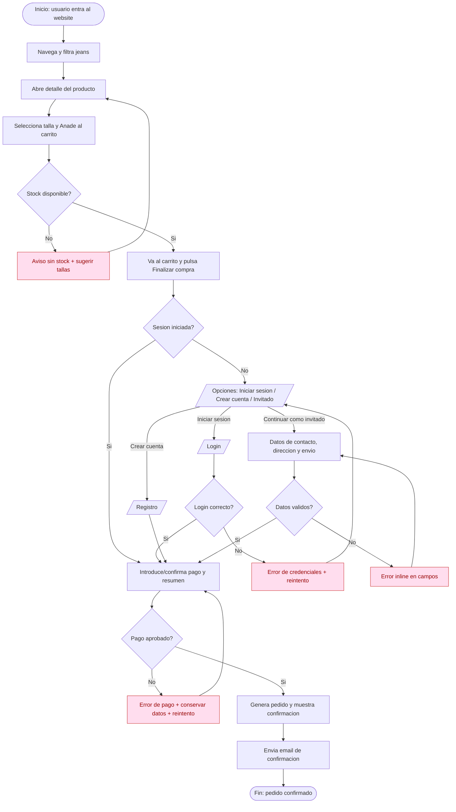

# User Flow — Compra de jeans sin sesión iniciada

> Deliverable de interaction design generado a partir de la User Story "Compra de jeans como usuario no autenticado". Producido con el método de user flows (steps, system responses y decision branches).

---

## Flow: Completar la compra de unos jeans sin estar autenticado

- **Type:** user flow
- **Actor:** Usuario no autenticado (visitante del ecommerce de moda)
- **Goal:** Recibir la confirmación de un pedido de jeans pagado, sin verse obligado a registrarse antes de pagar
- **Trigger (entry):** El usuario entra al website y navega a la categoría de jeans
- **Preconditions:** Ninguna obligatoria. El usuario no tiene sesión iniciada; el flujo gestiona el caso de no-autenticado. Debe existir stock del producto y talla elegidos.
- **Success (exit):** Se muestra la página de confirmación con número de pedido y se envía el email de confirmación

---

### Steps (happy path)

1. **[User]** Navega a la sección de jeans y filtra por talla/color/corte/precio → **[System]** Muestra el listado de productos → (Pantalla: Listado de jeans)
2. **[User]** Abre la página de detalle de unos jeans → **[System]** Muestra imágenes, precio, descripción, disponibilidad, tallas y opciones de entrega → (Pantalla: Detalle de producto)
3. **[User]** Selecciona una talla disponible y hace clic en "Añadir al carrito" → **[System]** Valida stock y confirma que el producto fue añadido → (Pantalla: Detalle + confirmación de añadido)
4. **[User]** Va al carrito y hace clic en "Finalizar compra" → **[System]** Detecta que no hay sesión iniciada y conserva el carrito → (Pantalla: Carrito)
5. **[System]** Muestra las opciones de autenticación: Iniciar sesión / Crear cuenta / Continuar como invitado → (Pantalla: Modal de checkout — autenticación)
6. **[User]** Elige "Continuar como invitado" e introduce datos de contacto, dirección de entrega y método de envío → **[System]** Valida los datos y mantiene el carrito intacto → (Pantalla: Checkout invitado)
7. **[User]** Introduce el método de pago, revisa el resumen del pedido, acepta términos y condiciones y hace clic en "Comprar ahora" → **[System]** Valida el pago → (Pantalla: Resumen y pago)
8. **[System]** Genera el número de pedido, muestra la pantalla de confirmación y envía el email de confirmación → (Pantalla: Confirmación de pedido)

---

### Decision points

- **D1 · ¿El usuario tiene sesión iniciada al pulsar "Finalizar compra"?**
  - Sí → salta directamente al paso 7 (datos de la cuenta ya disponibles)
  - No → paso 5 (mostrar opciones de autenticación / invitado)

- **D2 · ¿Qué opción de checkout elige el usuario?** (CA1)
  - "Continuar como invitado" → paso 6 (CA2)
  - "Iniciar sesión" → sub-flujo de login; al autenticarse con éxito, continuar checkout con el carrito intacto → paso 7 (CA4)
  - "Crear cuenta" → sub-flujo de registro; al registrarse, continuar checkout con el carrito intacto → paso 7 (CA5)

- **D3 · ¿El login es correcto?**
  - Sí → paso 7 (carrito conservado)
  - No → mostrar error de credenciales y permitir reintento; offramp: volver a las opciones de checkout

- **D4 · ¿Los datos de contacto/dirección/envío son válidos?**
  - Sí → continuar a pago
  - No → mostrar error inline en los campos afectados y volver al paso 6

- **D5 · ¿El pago fue aprobado?** (CA6)
  - Sí → paso 8 (generar pedido, confirmación y email)
  - No → mostrar error de pago, conservar los datos introducidos y permitir reintentar con otro método

---

### Alternate paths, errors, and edge cases

- **Carrito conservado (CA3):** en el paso 5 y durante todo el checkout el sistema mantiene producto, talla, cantidad y precio; el resumen del carrito permanece visible (consideración UX).
- **Cambio a login/registro sin perder datos (CA4, CA5):** si el usuario inicia sesión o se registra durante el checkout, no se le obliga a repetir la información ya introducida.
- **Producto/talla sin stock:** en el paso 3, si la talla se agota, mostrar aviso de indisponibilidad y sugerir tallas alternativas; offramp: volver al listado.
- **Error de validación de formulario:** email con formato inválido, campos obligatorios vacíos o dirección incompleta → error inline y recuperación en el mismo paso.
- **Pago rechazado o error de red al pagar:** mostrar mensaje claro, preservar datos y ofrecer reintento; offramp: guardar carrito y salir.
- **Sesión expira o el usuario cierra el checkout:** el carrito se conserva para retomar la compra más tarde.
- **Registro post-compra opcional:** tras la confirmación, ofrecer crear una cuenta con los datos ya usados (requisito funcional), sin bloquear ni interrumpir la confirmación.
- **Offramps generales:** volver atrás, cancelar checkout o guardar el carrito para más tarde en cualquier paso.

---

### Diagram

---

### Assumptions and open questions

- Se asume que las opciones de autenticación se presentan en un modal/pantalla dentro del checkout y que, tras login/registro, el usuario retorna al punto exacto del checkout sin perder datos. **Validar con producto.**
- Se asume que el carrito se conserva mediante sesión de invitado/cookie mientras el usuario no cierra el navegador. **Confirmar duración de persistencia del carrito.**
- Se asume validación de stock en el momento de añadir al carrito y de nuevo antes de confirmar el pago. **Confirmar si hay reserva temporal de stock.**
- El registro post-compra es opcional y no debe bloquear la confirmación. **Confirmar qué datos se preservan para el alta.**
- No se detalla el sub-flujo interno de recuperación de contraseña dentro de "Iniciar sesión". **Definir si aplica en este alcance.**
