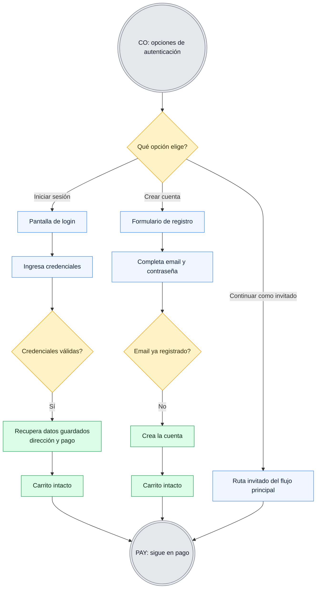
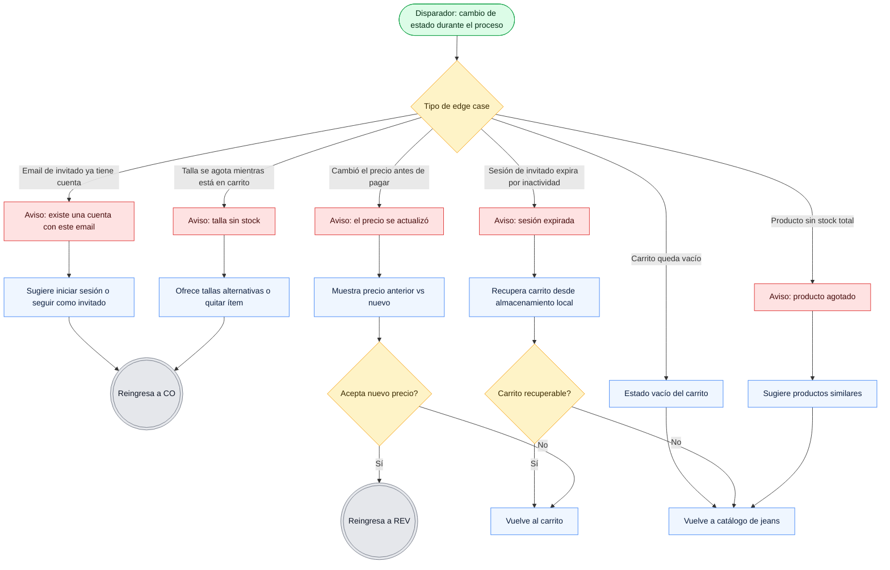
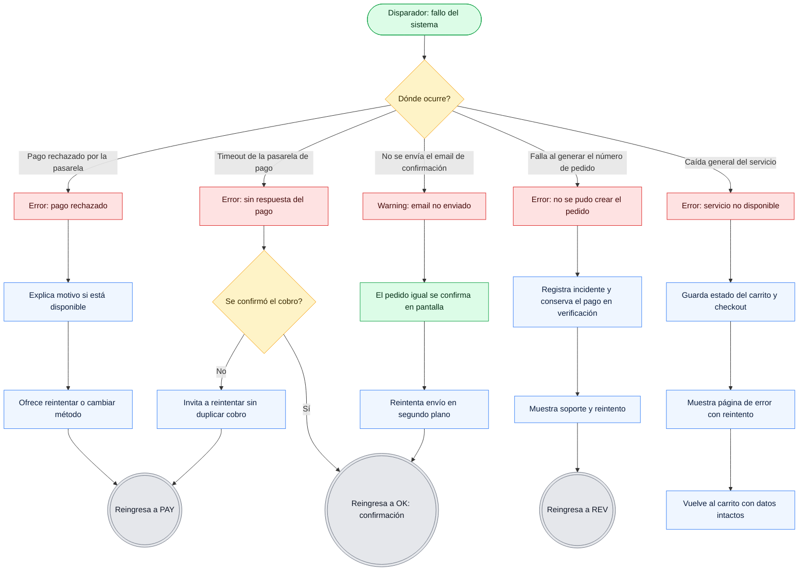
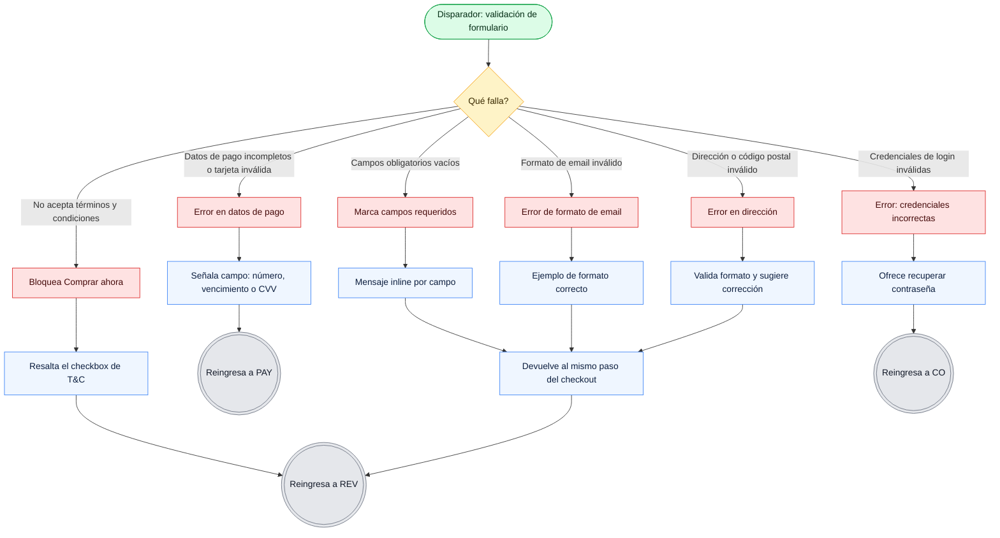

# User Flow — Compra de jeans sin sesión iniciada

**User story:** Como usuario no autenticado, quiero comprar unos jeans sin verme obligado a registrarme, para completar mi compra rápido.
**Objetivo del flujo:** Llevar a un usuario invitado desde el catálogo hasta la confirmación de pedido.
**Entry point único:** Usuario entra al ecommerce y navega la categoría de jeans.
**Success state:** Pantalla de confirmación con número de pedido + email de confirmación.

---

## Convención visual (leyenda)

Se usa la misma notación y paleta en todos los diagramas para mantener consistencia.

| Elemento | Forma | Color | Uso |
|---|---|---|---|
| Inicio / Fin | Estadio `([ ])` | Verde | Entry point y estados finales |
| Acción / Pantalla | Rectángulo `[ ]` | Azul | Paso del sistema o del usuario |
| Decisión | Rombo `{ }` | Ámbar | Bifurcación con condición |
| Éxito | Rectángulo | Verde | Resultado positivo |
| Error / Fallo | Rectángulo | Rojo | Estado de error del sistema o del usuario |
| Reingreso al flujo principal | Nodo referenciado `((A))` | Gris | Punto de retorno entre flujos |

**Puntos de conexión entre flujos** (para no repetir pasos):

- `((CO))` → **Checkout / opciones de autenticación**
- `((PAY))` → **Pantalla de pago**
- `((REV))` → **Revisión y confirmación del pedido**
- `((OK))` → **Confirmación de pedido**

---

## 1. Flujo principal (happy path)

Un único objetivo, un único entry point, mínimos pasos hasta la conversión. Sólo la ruta feliz de "continuar como invitado". Las variantes de login/registro, edge cases y errores viven en flujos aparte.

```mermaid
flowchart TD
    A([Inicio: usuario entra al ecommerce]):::terminador
    A --> B[Navega categoría Jeans]:::accion
    B --> C[Filtra por talla, color, corte o precio]:::accion
    C --> D[Abre detalle del producto]:::accion
    D --> E[Selecciona talla disponible]:::accion
    E --> F[Añadir al carrito]:::accion
    F --> G[Confirmación: producto añadido]:::accion
    G --> H[Ir al carrito]:::accion
    H --> I[Revisa producto, talla, cantidad y precio]:::accion
    I --> J[Finalizar compra]:::accion
    J --> CO(((CO))):::conector
    CO --> K{Estado de sesión?}:::decision
    K -->|No autenticado| L[Muestra opciones:<br/>Iniciar sesión / Crear cuenta / Continuar como invitado]:::accion
    L --> M[Continuar como invitado]:::accion
    M --> N[Introduce datos de contacto]:::accion
    N --> O[Añade dirección de entrega]:::accion
    O --> P[Selecciona método de envío]:::accion
    P --> PAY(((PAY))):::conector
    PAY --> Q[Introduce método de pago]:::accion
    Q --> REV(((REV))):::conector
    REV --> R[Revisa resumen del pedido]:::accion
    R --> S[Acepta términos y condiciones]:::accion
    S --> T[Comprar ahora]:::accion
    T --> U[Sistema valida el pago]:::accion
    U --> V[Genera número de pedido]:::exito
    V --> OK(((OK))):::conector
    OK --> W[Muestra pantalla de confirmación]:::exito
    W --> X[Envía email de confirmación]:::exito
    X --> Y[Ofrece crear cuenta post-compra opcional]:::accion
    Y --> Z([Fin: compra completada]):::terminador

    classDef terminador fill:#dcfce7,stroke:#16a34a,color:#052e16;
    classDef accion fill:#eff6ff,stroke:#3b82f6,color:#0c1e3e;
    classDef decision fill:#fef3c7,stroke:#f59e0b,color:#3a2a00;
    classDef exito fill:#dcfce7,stroke:#16a34a,color:#052e16;
    classDef error fill:#fee2e2,stroke:#dc2626,color:#450a0a;
    classDef conector fill:#e5e7eb,stroke:#6b7280,color:#111827;
```

---

## 2. Flujo alterno — Autenticación durante el checkout

Cubre las otras dos ramas de la decisión `Estado de sesión?`: **Iniciar sesión** y **Crear cuenta**. En ambos casos el carrito se conserva (CA3, CA4, CA5) y el usuario reingresa al flujo principal en `((PAY))` sin repetir la carga de datos ya conocidos.

**Ramas de error de este flujo → ver Flujo 5 (errores de usuario):** credenciales inválidas, email ya registrado.

---

## 3. Flujo de edge cases

Situaciones de borde que no son "error" del usuario ni caída del sistema, pero que alteran el estado del carrito o del producto durante el proceso. Cada rama indica su punto de reingreso al flujo principal.

---

## 4. Flujo de errores del sistema

Fallos originados en el backend, la pasarela de pago o servicios externos. El principio es no perder el carrito ni el progreso del usuario, y ofrecer siempre un reintento o una salida.

---

## 5. Flujo de errores del usuario

Errores de entrada o validación provocados por el usuario. Todos son recuperables: el sistema señala el campo, explica el problema y devuelve al usuario al punto exacto sin perder lo ya cargado.

---

## Checklist de revisión aplicado

| Criterio | Estado | Cómo se cumple |
|---|---|---|
| Un objetivo por flujo | ✅ | Flujo principal = comprar como invitado. Cada flujo secundario tiene un propósito único. |
| Un entry point claro | ✅ | Entrada única: usuario entra al ecommerce y navega jeans. |
| Mínimos pasos hasta completar | ✅ | Ruta feliz directa; variantes y errores fuera del camino principal. |
| Labels claros en acciones, pantallas y decisiones | ✅ | Cada nodo describe una acción o condición concreta. |
| Formas, colores y terminología consistentes | ✅ | Misma leyenda y `classDef` en los cinco diagramas. |
| Caminos de éxito, fallo y alternos incluidos | ✅ | Éxito (F1), alternos (F2), edge cases (F3), errores de sistema (F4) y de usuario (F5). |

---

## Cobertura de criterios de aceptación

- **CA1** (invitado inicia compra) → Flujo 1, nodos K–L.
- **CA2** (continuar como invitado) → Flujo 1, nodos M–Q.
- **CA3** (carrito se conserva) → Flujos 2 y 4 (F/K "carrito intacto"), Flujo 3 (recuperación de carrito).
- **CA4** (login durante checkout) → Flujo 2, rama Iniciar sesión.
- **CA5** (crear cuenta) → Flujo 2, rama Crear cuenta.
- **CA6** (confirmación de compra) → Flujo 1, nodos V–X.
